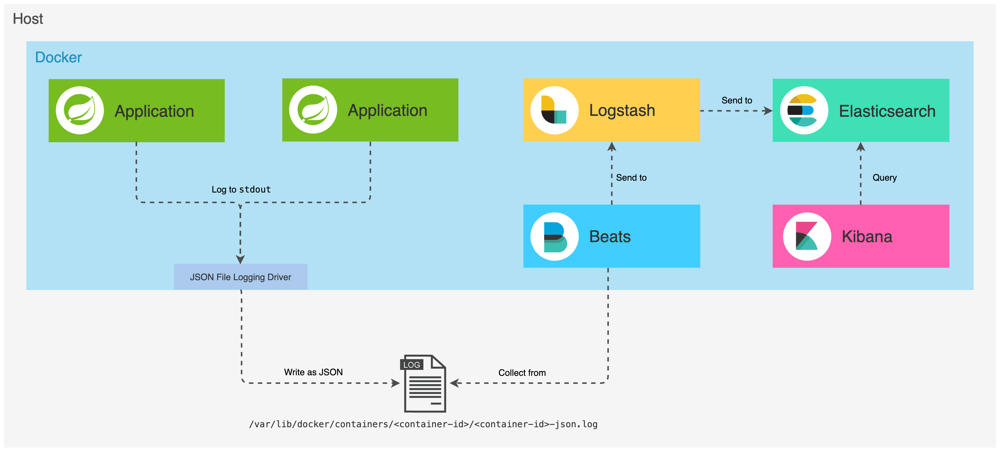

# Agregando logs com Spring Boot, ELK e Docker
Em uma arquitetura de microsserviços, uma única operação de negócios pode acionar uma cadeia de chamadas em downstream de microsserviços, o que pode ser bastante desafiador para depurar. As coisas, no entanto, podem ser mais fáceis quando os logs de todos os microsserviços são centralizados e cada evento de log contém detalhes que permitem rastrear as interações entre os aplicativos.

## O que é ELK?
O ELK é um grupo de aplicativos de código aberto da Elastic projetados para obter dados de qualquer fonte e em qualquer formato e, em seguida, pesquisar, analisar e visualizar esses dados em tempo real. Anteriormente, era conhecido como ELK Stack, em que as letras do nome representavam os aplicativos do grupo: Elasticsearch, Logstash e Kibana. Um quarto aplicativo (Beats) foi posteriormente adicionado à pilha, tornando o acrônimo em potencial impronunciável. Assim, o ELK Stack tornou-se o Elastic Stack.

- Elasticsearch é um mecanismo de análise e armazenamento distribuído em tempo real, baseado em JSON, projetado para escalabilidade horizontal, confiabilidade máxima e gerenciamento fácil. Ele pode ser usado para muitas finalidades, mas um contexto em que se destaca é a indexação de fluxos de dados semiestruturados, como logs ou pacotes de rede decodificados.
- O Kibana é uma plataforma de análise e visualização de código aberto projetada para funcionar com o Elasticsearch. O Kibana pode ser usado para pesquisar, visualizar e interagir com dados armazenados em índices Elasticsearch, permitindo análise avançada de dados e visualização de dados em uma variedade de gráficos, tabelas e mapas.
- Beats são um conjunto de agentes que podem ser instalados em servidores para enviar dados operacionais diretamente para o Elasticsearch ou via Logstash, onde podem ser processados e aprimorados.
- O Logstash é uma ferramenta poderosa que se integra a uma ampla variedade de implantações. Ele oferece uma grande variedade de plug-ins para ajudá-lo a analisar, enriquecer, transformar e armazenar em buffer dados de várias fontes. Se os dados exigirem processamento adicional que não esteja disponível no Beats, o Logstash poderá ser adicionado à implantação.

## Unindo as peças do quebra-cabeça
A ilustração a seguir mostra como os componentes do Elastic Stack interagem entre si:


Em poucas palavras:

- O Filebeat coleta dados dos arquivos de log e os envia para o Logststash.
- O Logstash aprimora os dados e os envia para o Elasticsearch.
- O Elasticsearch armazena e indexa os dados.
- O Kibana exibe os dados armazenados no Elasticsearch.

## Logs como fluxos de eventos
A metodologia Twelve-Factor App, um conjunto de práticas recomendadas para criar aplicativos de software como serviço, define logs como um fluxo de eventos agregados e ordenados por tempo coletados dos fluxos de saída de todos os processos em execução e serviços de apoio que fornecem visibilidade do comportamento de um aplicativo em execução. Este conjunto de melhores práticas recomenda que os logs sejam tratados como fluxos de eventos:

> Um ***Twelve-Factor App*** nunca se preocupa com o roteamento ou armazenamento de seu fluxo de saída. Ele não deve tentar gravar ou gerenciar arquivos de log. Em vez disso, cada processo em execução grava seu fluxo de eventos, sem buffer, em stdout. Durante o desenvolvimento local, o desenvolvedor visualizará esse fluxo em primeiro plano de seu terminal para observar o comportamento do aplicativo.
> 
> Em implantações de preparação ou produção, cada fluxo de processo será capturado pelo ambiente de execução, agrupado com todos os outros fluxos do aplicativo e roteado para um ou mais destinos finais para visualização e arquivamento de longo prazo. Esses destinos de arquivamento não são visíveis ou configuráveis pelo aplicativo e, em vez disso, são totalmente gerenciados pelo ambiente de execução.

Com isso em mente, o fluxo de eventos de log de um aplicativo pode ser roteado para um arquivo ou assistido via cauda em tempo real em um terminal ou, preferencialmente, enviado para um sistema de indexação e análise de log como o Elastic Stack.

## Log com Logback e SLF4J
O Logback é um sistema de registro maduro e flexível e que pode ser usado diretamente ou, preferencialmente, com o SLF4J

SLF4J uma fachada ou abstração de logs para várias estruturas. Para logar com SLF4J, primeiro temos que obter uma instância Logger usando LoggerFactory, conforme mostrado abaixo:

```
public class Example {
    final Logger log = LoggerFactory.getLogger(Example.class);
}
```
Para ser menos prolixo e evitar nos repetirmos em todas as classes que queremos realizar o logging, podemos usar o ***Lombok***. Ele fornece a anotação ***@Slf4j*** para gerar o campo logger para nós. A classe mostrada acima é equivalente à classe mostrada abaixo:

```
@Slf4j
public class Example {

}
```
Depois de obter a instância do logger, podemos executar o seguinte código:
```
log.trace("Logging at TRACE level");
log.debug("Logging at DEBUG level");
log.info("Logging at INFO level");
log.warn("Logging at WARN level");
log.error("Logging at ERROR level");
```
Mensagens parametrizadas com a sintaxe {} também podem ser usadas. Essa abordagem é preferível à concatenação de strings, pois não incorre no custo da construção do parâmetro caso o nível de log seja desabilitado:
```
log.debug("Found {} results", list.size());
```
Em aplicativos Spring Boot, o Logback pode ser configurado no arquivo ***logback-spring.xml***, localizado na pasta de recursos. Neste arquivo de configuração, podemos aproveitar os perfis do Spring e os recursos de modelagem fornecidos pelo Spring Boot.

```
<?xml version="1.0" encoding="UTF-8"?>
<configuration>
    <include resource="org/springframework/boot/logging/logback/defaults.xml"/>
    <include resource="org/springframework/boot/logging/logback/console-appender.xml" />
    <root level="INFO">
        <appender-ref ref="CONSOLE" />
    </root>
    <logger name="org.springframework.web" level="DEBUG"/>
</configuration>
```

## Aprimorando eventos de log com detalhes de rastreamento
Em uma arquitetura de microsserviços, uma única operação de negócios pode acionar uma cadeia de chamadas de microsserviço downstream e essas interações entre os serviços podem ser difíceis de depurar. Para facilitar as coisas, podemos usar o ***Spring Cloud Sleuth*** para aprimorar os logs do aplicativo com detalhes de rastreamento.

***Spring Cloud Sleuth*** é uma solução de rastreamento distribuído para ***Spring Cloud*** e adiciona um ID de rastreamento e um ID de extensão aos logs:

O span representa uma unidade básica de trabalho, por exemplo, enviar uma solicitação HTTP.
Um ***trace*** contém um conjunto de ***spans***, formando uma estrutura semelhante a uma árvore. O ID do rastreamento permanecerá o mesmo quando um microsserviço chamar o próximo.
Com essas informações, ao visualizar os logs, poderemos obter todos os eventos de um determinado trace ou span id, dando visibilidade ao comportamento da cadeia de interações entre os serviços.

Depois que a dependência do Spring Cloud Sleuth for adicionada ao classpath, todas as interações com os serviços downstream serão logadas automaticamente e os IDs de ***trace*** e extensão serão adicionados ao ***Mapped Diagnostic Context (MDC)*** do SLF4J, que será incluído nos logs.

```
<dependencyManagement>
    <dependencies>
        <dependency>
            <groupId>org.springframework.cloud</groupId>
            <artifactId>spring-cloud-sleuth</artifactId>
            <version>${spring-cloud-sleuth.version}</version>
            <type>pom</type>
            <scope>import</scope>
        </dependency>
    </dependencies>
</dependencyManagement>

<dependencies>
    <dependency>
        <groupId>org.springframework.cloud</groupId>
        <artifactId>spring-cloud-starter-sleuth</artifactId>
    </dependency>
</dependencies>
```

## Logando em formato JSON
Logback, por padrão, produzirá logs em texto simples. Mas como pretendemos que nossos eventos de log sejam indexados no Elasticsearch, que armazena documentos JSON, seria uma boa ideia produzir eventos de log no formato JSON.

Para realizá-lo, podemos usar o ***Logstash Logback Encoder***, que fornece codificadores, layouts e anexadores de Logback para efetuar log em JSON. O Logstash Logback Encoder foi originalmente escrito para oferecer suporte à saída no formato JSON do Logstash, mas evoluiu para um mecanismo de log estruturado de propósito geral altamente configurável para JSON e outros formatos de dados.

E, em vez de gerenciar arquivos de log diretamente, nossos microsserviços podem registrar na saída padrão usando o ConsoleAppender. Como os microsserviços serão executados em contêineres Docker, podemos deixar a responsabilidade de gravar os arquivos de log no Docker. Veremos mais detalhes sobre o Docker mais abaixo.

Para uma configuração simples e rápida, podemos usar o ***LogstashEncoder***, que vem com um conjunto predefinido de provedores:

```
<?xml version="1.0" encoding="UTF-8"?>
<configuration>

    <springProperty scope="context" name="application_name" source="spring.application.name"/>

    <appender name="jsonConsoleAppender" class="ch.qos.logback.core.ConsoleAppender">
        <encoder class="net.logstash.logback.encoder.LogstashEncoder"/>
    </appender>

    <root level="INFO">
        <appender-ref ref="jsonConsoleAppender"/>
    </root>
    
</configuration>
```
A configuração acima produzirá a seguinte saída de log (lembre-se de que a saída real é uma única linha, mas foi formatada abaixo para melhor visualização):

```
{
   "@timestamp": "2019-06-29T23:01:38.967+01:00",
   "@version": "1",
   "message": "Finding details of post with id 1",
   "logger_name": "net.local.poc.logaggregation.post.service.PostService",
   "thread_name": "http-nio-8001-exec-3",
   "level": "INFO",
   "level_value": 20000,
   "application_name": "post-service",
   "traceId": "c52d9ff782fa8f6e",
   "spanId": "c52d9ff782fa8f6e",
   "spanExportable": "false",
   "X-Span-Export": "false",
   "X-B3-SpanId": "c52d9ff782fa8f6e",
   "X-B3-TraceId": "c52d9ff782fa8f6e"
}
```

Este codificador inclui os valores armazenados no MDC por padrão. Quando ***Spring Cloud Sleuth*** estiver no classpath, as seguintes propriedades serão adicionadas ao MDC e serão registradas: ***traceId, spanId, spanExportable, X-Span-Export, X-B3-SpanId e X-B3-TraceId***.

Se precisarmos de mais flexibilidade no formato JSON e nos dados incluídos no log, podemos usar ***LoggingEventCompositeJsonEncoder***. O codificador composto não possui provedores configurados por padrão, então devemos adicionar os provedores que queremos para customizar a saída:

```
<?xml version="1.0" encoding="UTF-8"?>
<configuration>

    <springProperty scope="context" name="application_name" source="spring.application.name"/>

    <appender name="jsonConsoleAppender" class="ch.qos.logback.core.ConsoleAppender">
        <encoder class="net.logstash.logback.encoder.LoggingEventCompositeJsonEncoder">
            <providers>
                <timestamp>
                    <timeZone>UTC</timeZone>
                </timestamp>
                <version/>
                <logLevel/>
                <message/>
                <loggerName/>
                <threadName/>
                <context/>
                <pattern>
                    <omitEmptyFields>true</omitEmptyFields>
                    <pattern>
                        {
                            "trace": {
                                "trace_id": "%mdc{X-B3-TraceId}",
                                "span_id": "%mdc{X-B3-SpanId}",
                                "parent_span_id": "%mdc{X-B3-ParentSpanId}",
                                "exportable": "%mdc{X-Span-Export}"
                            }
                        }
                    </pattern>
                </pattern>
                <mdc>
                    <excludeMdcKeyName>traceId</excludeMdcKeyName>
                    <excludeMdcKeyName>spanId</excludeMdcKeyName>
                    <excludeMdcKeyName>parentId</excludeMdcKeyName>
                    <excludeMdcKeyName>spanExportable</excludeMdcKeyName>
                    <excludeMdcKeyName>X-B3-TraceId</excludeMdcKeyName>
                    <excludeMdcKeyName>X-B3-SpanId</excludeMdcKeyName>
                    <excludeMdcKeyName>X-B3-ParentSpanId</excludeMdcKeyName>
                    <excludeMdcKeyName>X-Span-Export</excludeMdcKeyName>
                </mdc>
                <stackTrace/>
            </providers>
        </encoder>
    </appender>

    <root level="INFO">
        <appender-ref ref="jsonConsoleAppender"/>
    </root>
    
</configuration>
```
Abaixo uma amostra da saída de log para a configuração acima. Novamente, a saída real é uma única linha, mas foi formatada para melhor visualização:

```
{  
   "@timestamp": "2019-06-29T22:01:38.967Z",
   "@version": "1",
   "level": "INFO",
   "message": "Finding details of post with id 1",
   "logger_name": "net.local.poc.logaggregation.post.service.PostService",
   "thread_name": "http-nio-8001-exec-3",
   "application_name": "post-service",
   "trace": {  
      "trace_id": "c52d9ff782fa8f6e",
      "span_id": "c52d9ff782fa8f6e",
      "exportable": "false"
   }
}
```
## Rodando no Docker
Iremos executar a Elastic Stack junto com nossos microsserviços Spring Boot em contêineres Docker:



Como teremos vários containers, usaremos o ***docker-compose*** para gerenciá-los. Com o Compose, os serviços do aplicativo são configurados em um arquivo YAML. Então, com um único comando, criamos e iniciamos todos os serviços de nossa configuração. Coisas muito legais!

Dê uma olhada em como os serviços são definidos e configurados no ***docker-compose.yml***. As labels são simplesmente metadados que só têm significado para quem os está usando. Vamos dar uma olhada rápida nas labels que foram definidos para os serviços:

- **collect_logs_with_filebeat**: Quando definido como true, indica que o Filebeat deve coletar os logs produzidos pelo contêiner do Docker.

- **decode_log_event_to_json_object**: o Filebeat coleta e armazena o evento de log como uma string na propriedade message de um documento JSON. Se os eventos forem registrados como JSON (que é o caso ao usar os anexadores definidos acima), o valor desse rótulo pode ser definido como true para indicar que o Filebeat deve decodificar a string JSON armazenada na propriedade da mensagem para um objeto JSON real.

Os microsserviços produzirão logs na saída padrão (stdout). Por padrão, o Docker captura a saída padrão (e o erro padrão) de todos os seus contêineres e os grava em arquivos no formato JSON, usando o driver de arquivo json. Os arquivos de log são armazenados no diretório ***/var/lib/docker/containers*** e cada arquivo de log contém informações sobre apenas um contêiner.

Quando os aplicativos são executados em contêineres, eles se tornam alvos móveis para o sistema de monitoramento. Portanto, usaremos o recurso de **autodiscover** do Filebeat, que permite rastrear os contêineres e adaptar as configurações à medida que as alterações acontecem. Ao definir modelos de configuração, o autodiscover pode monitorar serviços conforme eles começam a ser executados. Portanto, no arquivo ***filebeat.docker.yml***, o Filebeat é configurado para:

- Autodiscover dos contêineres do Docker que têm o label ***collect_logs_with_filebeat*** definido como true
- Coletar logs dos contêineres que foram descobertos
- Decodifique o campo de mensagem para um objeto JSON quando o log foi produzido por um contêiner que tem o label ***decode_log_event_to_json_object*** definido como true
- Enviar os log para o Logstash que é executado na porta 5044

```
filebeat.autodiscover:
  providers:
    - type: docker
      labels.dedot: true
      templates:
        - condition:
            contains:
              container.labels.collect_logs_with_filebeat: "true"
          config:
            - type: container
              format: docker
              paths:
                - "/var/lib/docker/containers/${data.docker.container.id}/*.log"
              processors:
                - decode_json_fields:
                    when.equals:
                      docker.container.labels.decode_log_event_to_json_object: "true"
                    fields: ["message"]
                    target: ""
                    overwrite_keys: true

output.logstash:
  hosts: "logstash:5044"
```
A configuração acima usa um único processador. Se precisarmos, podemos adicionar mais processadores, que serão encadeados e executados na ordem em que forem definidos no arquivo de configuração. Cada processador recebe um evento, aplica uma ação definida ao evento e o evento processado é a entrada do próximo processador até o final da cadeia.

Depois que o log é coletado e processado pelo ***Filebeat***, ele é enviado para o ***Logstash***, que fornece um rico conjunto de plug-ins para processamento adicional dos eventos.

A ***pipeline Logstash*** tem dois elementos obrigatórios, ***input*** e ***output***, e um elemento opcional, ***filter***. Os plug-ins de entrada consomem dados de uma fonte, os plug-ins de filtro modificam os dados conforme especificado e os plug-ins de saída gravam os dados em um destino.


No arquivo logstash.conf, o Logstash é configurado para:

- Receber eventos vindos do Beats na porta 5044
- Processar os eventos adicionando a tag logstash_filter_applied
- Enviar os eventos processados para o Elasticsearch que é executado na porta 9200

```
input {
  beats {
    port => 5044
  }
}

filter {
  mutate {
    add_tag => [ "logstash_filter_applied" ]
  }
}

output {
  elasticsearch {
    hosts => "elasticsearch:9200"
  }
}
```
O Elasticsearch armazenará e indexará os log e, por fim, poderemos visualizar os logs no Kibana, que expõe uma UI na porta 5601.

## Exemplo
Para este exemplo, vamos considerar que estamos criando um de controle para gerir empresas, departamentos e funcionários e teremos os seguintes microsserviços:

- service-organizacao: Gerencia os detalhes relacionados às empresas.
- service-departamento: Gerencia os detalhes relacionados aos departamento de uma empresa.
- service-empregado: Gerencia os detalhes relacionados aos empregados de uma empresa e associados a um departamento.

Cada microsserviço é um aplicativo Spring Boot, expondo uma API HTTP. Como pretendemos focar na agregação de logs, vamos simplificar quando se trata da arquitetura de serviços: um serviço simplesmente invocará o outro serviço diretamente.